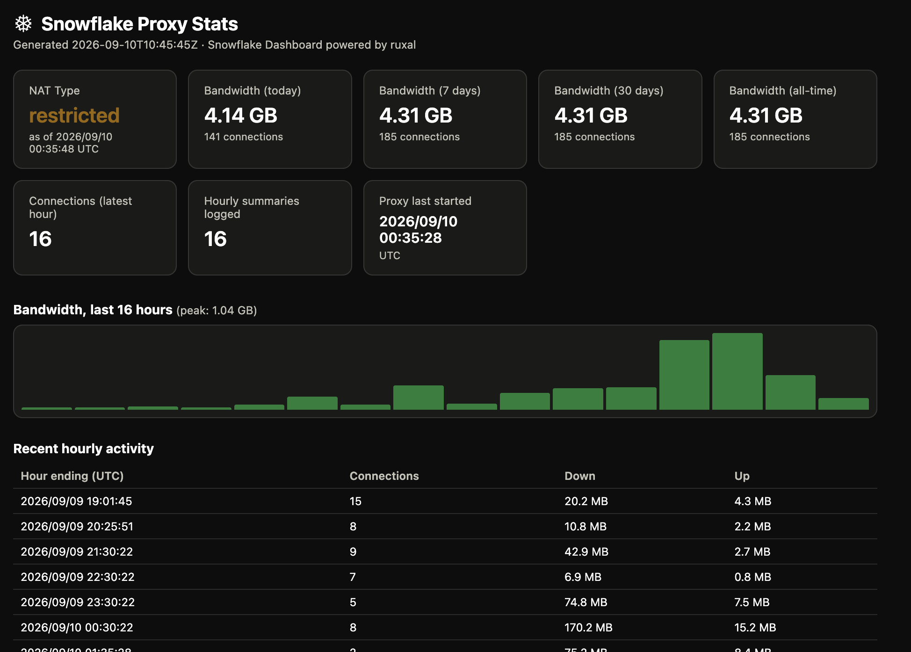

  

# Snowflake StartOS (sideload)

Initial build of the Snowflake sideloader for StartOS.

Built on MacOS Golden Gate with instructions from Claude including a nice Dashboard view 
Tested and confirmed working by the way of sideloading on StartOS running on a mac mini DIY

## Stats Dashboard

Clicking **Open UI** in the StartOS dashboard for this service shows a live stats page:

- **NAT type** — restricted or unrestricted, detected shortly after each proxy start
- **Bandwidth** for today, the last 7 days, the last 30 days, and all-time (shown in MB or GB depending on size), each with an up/down trend arrow comparing against the equivalent prior period once there's enough history
- **Connections** in the most recent completed hour
- A **bar chart**, labeled with its peak value, and a **table** of recent hourly activity
- Auto-refreshes every 5 minutes — no manual reload needed

Everything shown is computed from the proxy's own log output with no external dependencies, network calls, or JS charting libraries. History is stored on this service's persistent volume, so it survives restarts and updates, but starts from zero the first time this feature is installed, since there's no earlier log data to draw from.

## StartOS Packaging Notes

This package wraps the upstream Snowflake standalone proxy (`proxy/`) in a StartOS service. Two pieces are specific to this package, not part of upstream Snowflake:

- **`Dockerfile`** — a multi-stage build: compiles `snowflake-proxy` from `source/proxy` in a `golang:1.24-alpine` builder stage, then copies the binary into a minimal `alpine:3.19` runtime image alongside `busybox-extras` (needed for its `httpd` applet, which the default `busybox` package doesn't include).
- **`scripts/dashboard.sh`** — the container's entrypoint (invoked from `startos/main.ts`). It runs `snowflake-proxy`, tees its log output to `/data/snowflake.log` on the package's persistent volume (so history survives restarts and updates), regenerates a static stats page from that log every 5 minutes, and serves it on port 80 via `busybox-extras httpd`. This is what "Open UI" shows in the StartOS dashboard — NAT type, bandwidth totals, and a bar chart/table of recent hourly activity — all parsed directly from the proxy's own log lines with no external dependencies, network calls, or JS charting libraries involved.

See `instructions.md` for the end-user-facing description of the dashboard.

---

Snowflake is a censorship-evasion pluggable transport using WebRTC, inspired by Flashproxy.

<!-- START doctoc generated TOC please keep comment here to allow auto update -->
<!-- DON'T EDIT THIS SECTION, INSTEAD RE-RUN doctoc TO UPDATE -->
**Table of Contents**

- [Structure of this Repository](#structure-of-this-repository)
- [Usage](#usage)
  - [Using Snowflake with Tor](#using-snowflake-with-tor)
  - [Running a Snowflake Proxy](#running-a-snowflake-proxy)
  - [Using the Snowflake Library with Other Applications](#using-the-snowflake-library-with-other-applications)
- [Test Environment](#test-environment)
- [FAQ](#faq)
- [More info and links](#more-info-and-links)

<!-- END doctoc generated TOC please keep comment here to allow auto update -->

### Structure of this Repository

- `broker/` contains code for the Snowflake broker
- `doc/` contains Snowflake documentation and manpages
- `client/` contains the Tor pluggable transport client and client library code
- `common/` contains generic libraries used by multiple pieces of Snowflake
- `proxy/` contains code for the Go standalone Snowflake proxy
- `probetest/` contains code for a NAT probetesting service
- `server/` contains the Tor pluggable transport server and server library code

### Usage

Snowflake is currently deployed as a pluggable transport for Tor.

#### Using Snowflake with Tor

To use the Snowflake client with Tor, you will need to add the appropriate `Bridge` and `ClientTransportPlugin` lines to your [torrc](https://2019.www.torproject.org/docs/tor-manual.html.en) file. See the [client README](client) for more information on building and running the Snowflake client.

#### Running a Snowflake Proxy

You can contribute to Snowflake by running a Snowflake proxy. We have the option to run a proxy in your browser or as a standalone Go program. See our [community documentation](https://community.torproject.org/relay/setup/snowflake/) for more details. 

#### Using the Snowflake Library with Other Applications

Snowflake can be used as a Go API, and adheres to the [v2.1 pluggable transports specification](). For more information on using the Snowflake Go library, see the [Snowflake library documentation](doc/using-the-snowflake-library.md).

### Test Environment

There is a Docker-based test environment at https://github.com/cohosh/snowbox.

### FAQ

**Q: How does it work?**

In the Tor use-case:

1. Volunteers visit websites that host the 'snowflake' proxy, run a snowflake [web extension](https://gitlab.torproject.org/tpo/anti-censorship/pluggable-transports/snowflake-webext), or use a standalone proxy.
2. Tor clients automatically find available browser proxies via the Broker
(the domain fronted signaling channel).
3. Tor client and browser proxy establish a WebRTC peer connection.
4. Proxy connects to some relay.
5. Tor occurs.

More detailed information about how clients, snowflake proxies, and the Broker
fit together on the way...

**Q: What are the benefits of this PT compared with other PTs?**

Snowflake combines the advantages of flashproxy and meek. Primarily:

- It has the convenience of Meek, but can support magnitudes more
users with negligible CDN costs. (Domain fronting is only used for brief
signalling / NAT-piercing to setup the P2P WebRTC DataChannels which handle
the actual traffic.)

- Arbitrarily high numbers of volunteer proxies are possible like in
flashproxy, but NATs are no longer a usability barrier - no need for
manual port forwarding!

**Q: Why is this called Snowflake?**

It utilizes the "ICE" negotiation via WebRTC, and also involves a great
abundance of ephemeral and short-lived (and special!) volunteer proxies...

### More info and links

We have more documentation in the [Snowflake wiki](https://gitlab.torproject.org/tpo/anti-censorship/pluggable-transports/snowflake/-/wikis/home) and at https://snowflake.torproject.org/.

##### -- Android AAR Reproducible Build Setup  --

Using `gomobile` it is possible to build snowflake as shared libraries for all
the architectures supported by Android.  This is in the _.gitlab-ci.yml_, which
runs in GitLab CI.  It is also possible to run this setup in a Virtual Machine
using [vagrant](https://www.vagrantup.com/).  Just run `vagrant up` and it will
create and provision the VM.  `vagrant ssh` to get into the VM to use it as a
development environment.

##### uTLS Settings

Snowflake communicate with broker that serves as signaling server with TLS based domain fronting connection, which may be identified by its usage of Go language TLS stack.

uTLS is a software library designed to initiate the TLS Client Hello fingerprint of browsers or other popular software's TLS stack to evade censorship based on TLS client hello fingerprint with `-utls-imitate` . You can use `-version` to see a list of supported values.

Depending on client and server configuration, it may not always work as expected as not all extensions are correctly implemented.

You can also remove SNI (Server Name Indication) from client hello to evade censorship with `-utls-nosni`, not all servers supports this.
